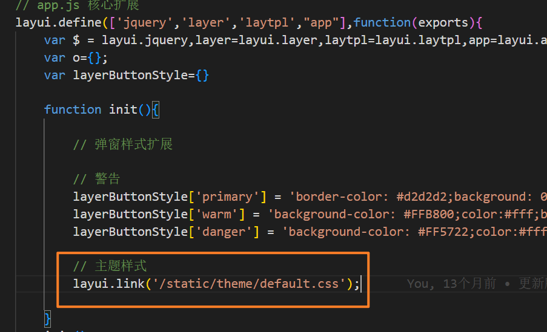

# 日历记事本（PHP+Layui）

**[演示站点](http://rilidemo.enianteam.com/)(自行注册即可) | [更新说明日志](https://gitee.com/hslr/calendar_notepad/blob/master/update_log.md) | Q群:685960647(请备注gitee)**

## 💥 迁移至锂日历（开启新版）

全新版本[Li Calendar - 锂日历记事本](https://gitee.com/li-calendar-notepad/li-calendar-gin)已经可以使用了。新版本框架Go+Gin+vue3+ElementUI-Plus。当前版本将不再开发新功能。本版本老用户可以通过`登录管理员账号`->`管理平台`->`迁移至锂日历`进行迁移至新版本。新用户请直接使用新版本。


## 🎉 介绍
日历记事本是基于PHP语言的ThinkPHP5.1+前端Layui+日历插件进行开发的一个记事本软件。因为工作中常常要记录每天的工作日志，所以2020的上半年，抽了几天的下班时间开发了他，稳定运行了一年，但是他有些不足，2021决定重新启动此项目，对他进行优化和增加功能。希望给每个需要的人使用。

## 🎁 软件架构
ThinkPHP5.1 + 前端Layui + Fullcalendar

## 🧨 更新说明
[查看更新说明](https://gitee.com/hslr/calendar_notepad/blob/master/update_log.md)

## 🍕 软件导图（PHP版本）
.png")


## 🥩 页面展示


.png")

## 🍚 开发计划
[点击查看开发计划和进度](https://thoughts.teambition.com/share/617215d0f53beb0041053ef5#title=日历记事本（网页）)

## 🍠 开发vlog视频

[[头条、西瓜]](https://www.ixigua.com/7026667370643096095) [[哔哩哔哩]](https://space.bilibili.com/27407696)


## 🍤 安装教程

[我个人的开发环境请点击参考（图文）](http://blog.enianteam.com/u/sun/content/56)

[B站 详细视频教程](https://www.bilibili.com/video/BV1Mq4y167Cn/)

其他请参考ThinkPHP5.1[官网教程文档](https://www.kancloud.cn/manual/thinkphp5_1/353946)

## 🚄 访问方式：
```
新版本：[你的ip或域名+端口]
旧版本：[你的ip或域名+端口]/calendar

默认账号密码：
账号：test123
密码：123456
```

## 🧡 中国法定节假日

> 包含法定节假日和周末等所有假日，是由[提莫的神秘小站-免费节假日 API](http://timor.tech/api/holiday)提供。

**浏览器登录账号后**，直接访问：http://[你的ip(域名)+端口]/holiday/export/y/[年份]

示例：
http://127.0.0.1:8080/holiday/export/y/2023

本法定节假日已经包含周末。

#### 实现方式（更新不及时可自行操作）
将`http://timor.tech/api/holiday/year/2023?type=Y&week=Y`内容导出为json文件，命名为`2023.json`存放入`/holiday-json`目录下，最后按上面流程操作即可（其中年份按自己需求更改）。


## 🎨 修改主题方式

- 主题目录：`public/static/theme/`
- 修改的js文件：`public/static/app/my_base.js`


1. 你可以根据`*主题目录*`中的`default_demo.css`demo样式文件衍生出属于你的个性主题，并文件存放在主题目录中。
2. 打开`*my_base.js*`修改init方法中的主题配置改为你的主题文件名称即可。（改完请清除一下浏览器缓存）
