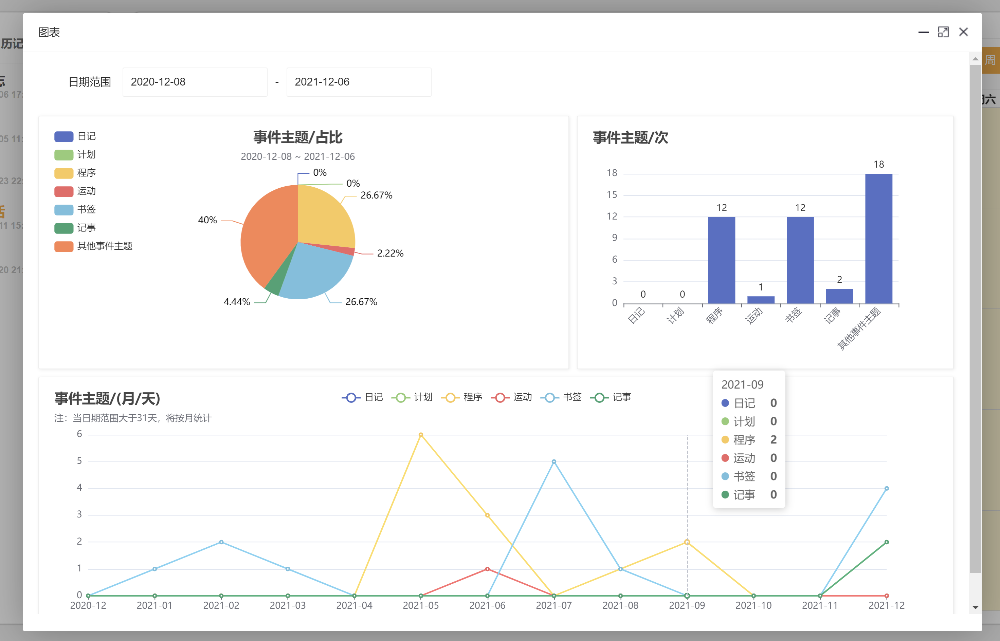

# 日历记事本v1(网页记事本)

## 💥💥💥v2版本已在路上

**全新版本正在开发中，请看开发计划：[日历记事本v2（Gin+vue3）开发计划](https://flowus.cn/eae743ef-337d-4dba-b1f7-3c34fdbdb7ce)。新版本开发完成后仍会开源，不过目前在开发中还未成型。新版本发布之后v1版本可使用迁移工具无缝将原有数据迁移到v2版本中，所以您现在可以继续使用v1版本。**

#### 介绍

日历记事本是基于PHP语言的ThinkPHP5.1+前端Layui+日历插件进行开发的一个记事本软件。因为工作中常常要记录每天的工作日志，所以去年的上半年，抽了几天的下班时间开发了他，稳定运行了一年，但是他有些不足，现在决定重新启动此项目，对他进行优化和增加功能。希望给每个需要的人使用。

#### QQ交流群(685960647)
 群名：`小猎人的程序屋`

 群号：685960647

#### 软件架构
ThinkPHP5.1 + 前端Layui + Fullcalendar

#### 更新说明（老用户必看）

[查看更新说明](https://gitee.com/hslr/calendar_notepad/blob/master/update_log.md)

#### 节假日

> 包含法定节假日和周末等所有假日 

登录账号后，浏览器直接访问：http://[你的ip(域名)+端口]/holiday/y_2022

#### 软件导图（PHP版本）
.png")

#### 演示站点
[演示站点](http://rilidemo.enianteam.com/)，自行注册即可

#### 页面展示

#### 开发计划
[点击查看开发计划和进度](https://thoughts.teambition.com/share/617215d0f53beb0041053ef5#title=日历记事本（网页）)

#### 开发vlog视频

[[头条、西瓜]](https://www.ixigua.com/7026667370643096095) [[哔哩哔哩]](https://space.bilibili.com/27407696)

#### 安装教程

[我个人的开发环境请点击参考（图文）](http://blog.enianteam.com/u/sun/content/56)

[B站 详细视频教程](https://www.bilibili.com/video/BV1Mq4y167Cn/)

其他请参考ThinkPHP5.1[官网教程文档](https://www.kancloud.cn/manual/thinkphp5_1/353946)

#### 访问方式：

    新版本：[你的ip或域名+端口]
    
    旧版本：[你的ip或域名+端口]/calendar

默认账号密码：

账号：test123

密码：123456